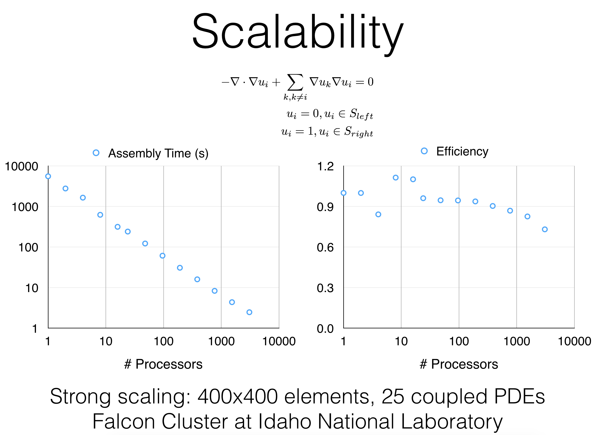

# Going Parallel

This example builds off of the [PETSc Example](petsc.md).  To run in parallel you must have `PETSc` setup as described in the [Installation Guide](../installation.md).

## MPI

MPI stands for "Message Passing Interface".  It is [a standard](http://mpi-forum.org) describing how computers can efficiently send messages to eachother when working in a cluster environment.  Although it is still evolving it is also extremely mature having been around for more than 20 years.

MOOSE.jl uses MPI through [MPI.jl](https://github.com/JuliaParallel/MPI.jl): MPI bindings for Julia.  It picks up MPI.jl through [MiniPETSc.jl](https://github.com/friedmud/MiniPETSc.jl): the Julia PETSc bindings.  Using MPI, MOOSE.jl can scale to thousands of processors on large clusters.

## Mesh Partitioning

The most straightforward way to parallelize a FEM solve is by splitting the domain (the elements) up over the available processors.  In this way each processor receives a portion of the domain to work on and the load is balanced.  However, just choosing any random splitting of elements is non-optimal.  Communication overhead can ruin parallel scalability.  Therefore it is necessary to seek domain splittings that minimize the amount of communication.  This process is called: "Partitioning" the mesh.

MOOSE.jl utilize a library called [METIS](http://glaros.dtc.umn.edu/gkhome/metis/metis/overview) for this purpose.  METIS is very mature graph partitioning software.  Given the connectivity graph METIS will attempt to solve for an optimal partitioning that balances the load and reduces communication costs.

MOOSE.jl retrieves METIS through Julia bindings that are currently located within MOOSE.jl (but may be moved to their own package later).  Currently, it is required that METIS be built into the PETSc library you are using (see [Installation](../installation.md)).

## Running in Parallel

With MPI, PETSc and METIS in place: the only thing you need to do to run a MOOSE.jl script in parallel is to make sure you are using a `Petsc*` solver (like `PetscImplicitSolver`) and then launch your script using `mpiexec` (or `mpirun` depending on your MPI installation):

```bash
mpiexec -n 4 julia yourscript.jl
```

That will launch `4` MPI processes that will all work together to solve the problem.

That's it!  No other code needs to change!

## Small Issue: "Compiling"

Unfortunately: Julia does not really expect to be launched simultaneously like this... and one of the things Julia does (pre-compiling Packages) can run into trouble.  The issue is that if you have modified (or just installed) a Julia Package, the first time you attempt to run a script that uses it Julia will "pre-compile" that package to make it faster to launch scripts that use it in the future.

Unfortunately, when Julia does this it tries to write files within a directory in your home directory.  If multiple Julia instances are launched simultaneously they will ALL attempt to precompile the package and all attempt to overwrite eachother's pre-compiled files.  This leads to crazy errors.

To combat this: always make sure to run your MOOSE.jl scripts _without_ `mpiexec` first... to get MOOSE.jl (and everything it depends on) to pre-compile in serial.  Then you can run in parallel.

In fact: it's not necessary to run a full solve.  Simply create a file that has this in it (I call mine `compile.jl`):

```julia
using MOOSE
```

And then you can execute your real script like this:

```bash
julia compile.jl && mpiexec -n 4 julia myscript.jl
```

That will run the short `compile.jl` script in serial first... ensuring that MOOSE.jl is compiled and then launch the real script in parallel...

## Scalability

Scalability of MOOSE.jl depends quite a lot on the linear solver/preconditioner you choose to use with PETSc and the particular problem you are solving.  That said, the finite-element assembly part of MOOSE.jl does scale well.  The result below is for a coupled set of 25 PDEs being assembled on a 400x400 element mesh on up to 3,072 processors.

 