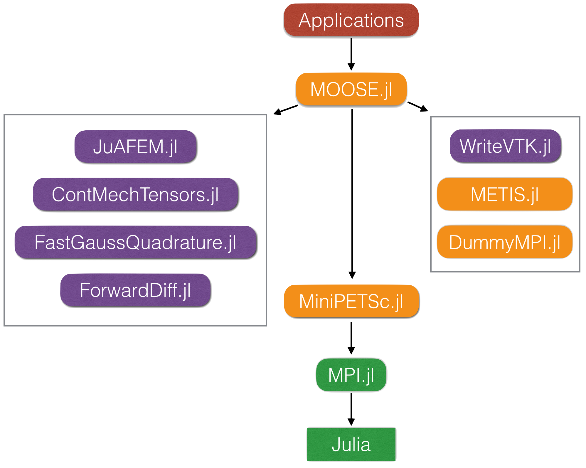

# Installation
MOOSE.jl currently requires a few packages that need to be manually installed.

## Parallelism

If you are *not* planning on running in parallel you can _skip_ this section and go right to installing Julia Packages...

To run in parallel you need a working installation of MPI and PETSc.  MOOSE.jl has been tested with MPICH and MVAPICH, but any working MPI installation should work fine.

### PETSc

In addtion to MPI, you will also need a working installation of [PETSc](https://www.mcs.anl.gov/petsc/).  There are many ways to get a working installation of PETSc.  You may be able to install it through your package manager, or you could use the MOOSE redistributable package from [Step 1](http://mooseframework.org/getting-started/) of the [MOOSE Getting Started guide](http://mooseframework.org/getting-started/).

Your other option is to [download the source](https://www.mcs.anl.gov/petsc/download/index.html) and compile it yourself.  MOOSE.jl has been tested with PETSc version 3.6.1 but will probably work with any recent version.

You will need to choose a place to install PETSc and export this in your environment as `PETSC_DIR`.  MOOSE.jl uses `PETSC_DIR` to know not only where to find PETSc but also whether or not to attempt to use PETSc at all.

To configure PETSc we recommend something like the following:

```bash
./configure \
--prefix=$PETSC_DIR \
--download-hypre=1 \
--with-ssl=0 \
--with-debugging=no \
--with-pic=1 \
--with-shared-libraries=1 \
--with-cc=mpicc \
--with-cxx=mpicxx \
--with-fc=mpif90 \
--download-fblaslapack=1 \
--download-metis=1 \
--download-parmetis=1 \
--download-superlu_dist=1 \
--download-mumps=1 \
--download-scalapack=1 \
CC=mpicc CXX=mpicxx FC=mpif90 F77=mpif77 F90=mpif90 \
CFLAGS='-fPIC -fopenmp' \
CXXFLAGS='-fPIC -fopenmp' \
FFLAGS='-fPIC -fopenmp' \
FCFLAGS='-fPIC -fopenmp' \
F90FLAGS='-fPIC -fopenmp' \
F77FLAGS='-fPIC -fopenmp' \
PETSC_DIR=`pwd`
```

In particular `--download-metis` is critical for MOOSE.jl.  MOOSE.jl uses METIS for mesh partitioning in parallel and will not work in parallel without it.  MOOSE.jl currently expects METIS to exist as part of your PETSC installation.

Other than that, follow the PETSc installation instructions or you can follow the [recommended PETSc instructions](http://mooseframework.org/wiki/BasicManualInstallation/OSX/#4-petsc) for MOOSE.

## Julia Packages

To get all of the dependencies and MOOSE.jl... within a Julia 0.5 session do:

```julia
Pkg.clone("https://github.com/KristofferC/ContMechTensors.jl.git")
Pkg.clone("https://github.com/friedmud/JuAFEM.jl.git")
Pkg.clone("https://github.com/friedmud/DummyMPI.jl.git")
```

If you went through the steps to set up MPI and PETSc then you should be able to use the `MiniPETSc` package:

```julia
Pkg.clone("https://github.com/friedmud/MiniPETSc.jl.git")
```

Then, installing MOOSE.jl can be done via:

```julia
Pkg.clone("https://github.com/friedmud/MOOSE.jl.git")
```

If you are new to Julia, you should know that these commands typically install the packages within the `~/.julia/v0.5` directory in your home directory.  If you navigate there you will see the `MOOSE` directory.  Inside of that directory are example problems and tests that can be instructive on how to use MOOSE.jl.

Below is a schematic showing most of the Julia packages that MOOSE.jl ultimately depends on:


